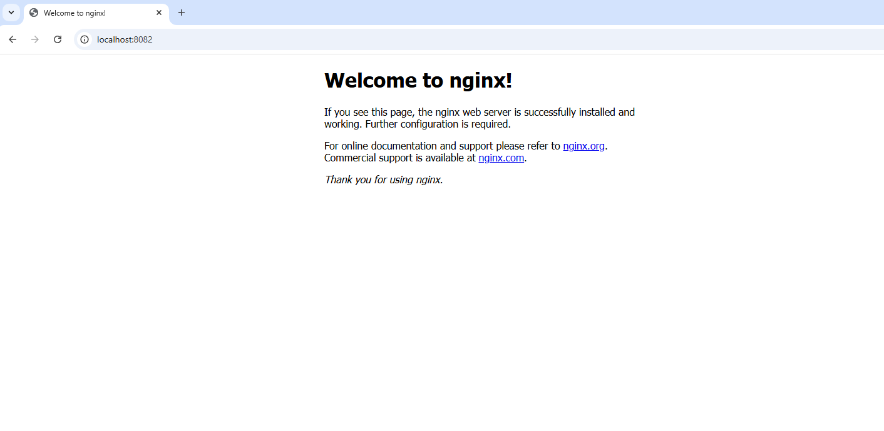

# Terraform Docker Demo

## Objective
Provision a **local Docker container** using **Terraform** (Infrastructure as Code - IaC).  

This demo uses the **Docker provider** in Terraform to pull an image and run a container on Windows.

---

## Prerequisites

1. **Docker Desktop** installed and running.  
   Test with:
   ```powershell
   docker ps
   ```
You should see running containers or an empty list.

2. **Terraform v1.13.3** or later installed.

Test with:

terraform -version


PowerShell or CMD (avoid Git Bash for Docker on Windows).

### Folder Structure
tf-docker-demo/
├── main.tf                 # Terraform configuration
├── variables.tf            # Variable definitions
├── terraform.tfvars.example # Example values for variables
├── .gitignore              # Ignore sensitive and state files
└── README.md               # This documentationFolder Structure

## Step-by-Step Instructions

### 1️⃣ Copy example variables
cp terraform.tfvars.example terraform.tfvars


Edit terraform.tfvars if needed.

Example:
```bash
container_name = "tf-nginx"
image          = "nginx:latest"
external_port  = 8082
env_vars       = []
docker_host    = "npipe:////./pipe/docker_engine"  # Windows Docker Desktop
```
### 2️⃣ Initialize Terraform
```
terraform init
```
- Downloads the Docker provider.
- Creates .terraform.lock.hcl to lock provider versions.

### 3️⃣ Preview Plan
```
terraform plan
```

Shows what resources Terraform will create.

Example output:
```
Plan: 2 to add, 0 to change, 0 to destroy.
```
### 4️⃣ Apply Plan

```
terraform apply
```

- Type yes when prompted.
- Creates:

   - Docker image (nginx:latest)
   - Docker container (tf-nginx) with host port 8082 → container port 80

### 5️⃣ Verify Container
```
docker ps
```

Example output:

```
CONTAINER ID   IMAGE          COMMAND                  PORTS                    NAMES
abcd1234       nginx:latest   "/docker-entrypoint.…"   0.0.0.0:8082->80/tcp    tf-nginx
```

- Open browser: http://localhost:8082
 → Nginx welcome page.

### 6️⃣ Inspect Terraform State

```
terraform state list
terraform state show docker_container.nginx
```

### 7️⃣ Destroy Resources

```
terraform destroy -auto-approve
```

Cleans up container and image.

Always use destroy when done to avoid unused Docker resources.

### Notes for Windows Users

- Docker provider host must be set to:

host = "npipe:////./pipe/docker_engine"


- Avoid using Git Bash for running Terraform with Docker Desktop on Windows. Use PowerShell or CMD.
- Default Nginx container port is 80. Map external to a free host port (e.g., 8082).

Screenshots:
  

### Interview Tips / Key Concepts Learned

#### What is IaC?

Infrastructure defined and managed via code, not manual steps.

#### How Terraform Works

Reads configuration → generates execution plan → applies plan to provision resources → maintains state.

#### Terraform State File

Keeps track of current resources. (terraform.tfstate)

#### Plan vs Apply

plan → previews changes

apply → executes changes

#### Terraform Providers

Plugins that allow Terraform to manage specific platforms (e.g., Docker, AWS, Azure)

#### Resource Dependency

Terraform automatically handles resource creation order based on references.

#### Handling Secrets

Use .tfvars or environment variables, mark as sensitive.

#### Benefits

Automation, reproducibility, version control, easy rollback, collaboration.